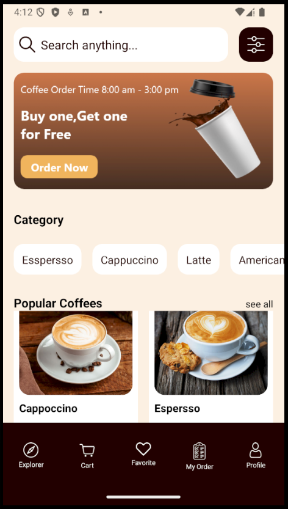
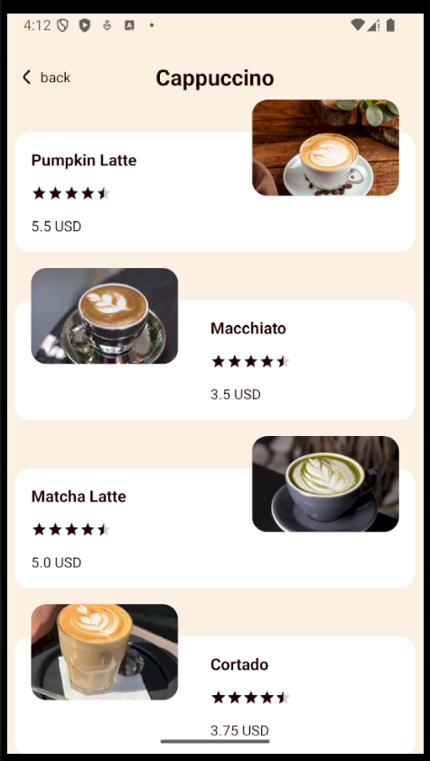
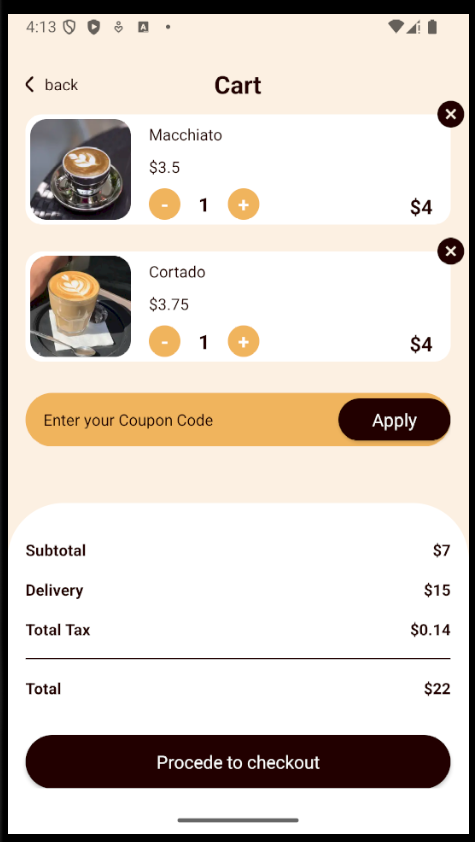

# ☕ Shivam's Coffee - Android Coffee Shop App

A modern Android mobile application built with Kotlin that simulates a coffee shop, allowing users to browse a variety of coffee products, manage their shopping cart, and explore different coffee categories.


## 📱 Features

- **Splash Screen**: Welcome screen with branding
- **Product Browsing**: Browse various coffee products with images and descriptions
- **Category Filtering**: Filter coffee products by different categories
- **Product Details**: View detailed information about each coffee item
- **Shopping Cart**: Add items to cart, adjust quantities, and manage orders
- **Firebase Integration**: Real-time database for product data
- **Modern UI**: Clean and intuitive user interface with Material Design

## 🏗️ Architecture

This project follows the **MVVM (Model-View-ViewModel)** architecture pattern with the following structure:

```
app/src/main/java/com/shivam/coffeeapp/
├── Activity/           # UI Activities
│   ├── SplashActivity.kt
│   ├── MainActivity.kt
│   ├── DetailActivity.kt
│   ├── ItemsListActivity.kt
│   └── CartActivity.kt
├── Adapter/            # RecyclerView Adapters
│   ├── CategoryAdapter.kt
│   ├── PopularAdapter.kt
│   ├── ItemsListCategoryAdapter.kt
│   └── CartAdapter.kt
├── Domain/             # Data Models
│   ├── BannerModel.kt
│   ├── CategoryModel.kt
│   └── ItemsModel.kt
├── Helper/             # Helper Classes
│   ├── ManagmentCart.kt
│   └── ChangeNumberItemsListener.kt
├── Repository/         # Data Repository
│   └── MainRepository.kt
└── ViewModel/          # ViewModels
    └── MainViewModel.kt
```

## 🛠️ Tech Stack

### Core Technologies
- **Kotlin** - Primary programming language
- **Android SDK 24+** - Android platform
- **View Binding** - Type-safe view access

### Libraries & Dependencies
- **Firebase Realtime Database** - Backend data storage
- **Glide** - Image loading and caching
- **Gson** - JSON parsing
- **Material Components** - Modern UI components
- **AndroidX Core KTX** - Kotlin extensions
- **ConstraintLayout** - Flexible layouts

### Build & Configuration
- **Gradle (Kotlin DSL)** - Build system
- **Google Services** - Firebase integration

## 📋 Prerequisites

Before running this project, ensure you have:

- Android Studio (Latest version recommended)
- JDK 11 or higher
- Android SDK with API level 24 or higher
- Firebase account (for database configuration)

## ⚙️ Setup Instructions

### 1. Clone the Repository

```bash
git clone https://github.com/Shivam-Gupta-DS/mycafe.git
cd mycafe
```

### 2. Configure Firebase

> **Important**: The `google-services.json` file is not included in this repository for security reasons.

To set up Firebase:

1. Go to [Firebase Console](https://console.firebase.google.com/)
2. Create a new project or use an existing one
3. Add an Android app to your Firebase project
4. Register your app with package name: `com.shivam.coffeeapp`
5. Download the `google-services.json` file
6. Place it in the `app/` directory of this project

```
mycafe/
└── app/
    └── google-services.json  ← Place your file here
```

### 3. Build and Run

1. Open the project in Android Studio
2. Sync the project with Gradle files
3. Connect an Android device or start an emulator
4. Click **Run** (Shift + F10) to build and install the app

## 🔥 Firebase Database Structure

Set up your Firebase Realtime Database with the following structure:

```json
{
  "Banner": [...],
  "Category": [...],
  "Items": [
    {
      "title": "Coffee Name",
      "price": 4.99,
      "description": "Coffee description",
      "picUrl": "image_url",
      "categoryId": 1,
      "rating": 4.5
    }
  ]
}
```

## 📸 Screenshots

<p align="center">
  
  
  
  
</p>


## 🔒 Security Notes

- The `google-services.json` file contains sensitive Firebase configuration and is excluded from version control
- The `local.properties` file (SDK path) is also gitignored
- Never commit API keys or sensitive credentials to the repository

## 🚀 Building for Release

To create a release build:

```bash
./gradlew assembleRelease
```

The APK will be generated at:
```
app/build/outputs/apk/release/app-release-unsigned.apk
```

## 🤝 Contributing

Contributions are welcome! Please feel free to submit a Pull Request.

1. Fork the repository
2. Create your feature branch (`git checkout -b feature/AmazingFeature`)
3. Commit your changes (`git commit -m 'Add some AmazingFeature'`)
4. Push to the branch (`git push origin feature/AmazingFeature`)
5. Open a Pull Request

## 📄 License

This project is open source and available under the MIT License.

## 👨‍💻 Developer

**Shivam Gupta**
- GitHub: [@Shivam-Gupta-DS](https://github.com/Shivam-Gupta-DS)

## 🙏 Acknowledgments

- Firebase for the backend infrastructure
- Material Design for UI components
- Glide for efficient image loading

---

**Note**: This is a demonstration/learning project for Android development with Kotlin and Firebase.
